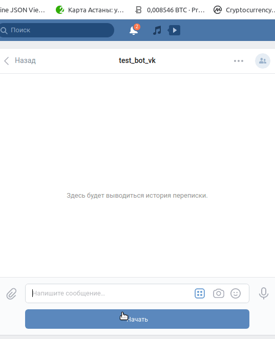

## Test bot

Test bot work by [Telegram messenger](https://web.telegram.org/#/login) and [VKontakte](http://vk.com/) social network.

## Getting Started
- Clone repository from github.
- Create virtual environment.
- Install using pip with: ```pip install -r requirements.txt``` .
- Create ```.env``` file and fill with:
```python
DB_PASSWORD='Redis database password'
DB_URL='Redis database url'
DB_PORT='Redis database port'
TG_BOT_TOKEN='Bot token from Telegram'
VK_BOT_KEY='api group key'
DIR='Question files local repository'
```

## Deploy on Heroku

- Two scripts must be specified In Procfile:
``` 
bot-tg: python3 tg_bot.py
bot-vk: python3 vk_bot.py 
``` 
- Deploy git repository in Heroku server.
- Carry over all variables from ```.env``` to ```Reveal Config Vars``` in heroku/settings.

## Running

Running from command line:
```shell script
python tg_bot.py
```
to start telegram bot.


```shell script
python vk_bot.py 
```

to start vkontakte bot.



### Repository change

If question files repository changed, use :
```shell script
python quiz_questions.py -l 'you repository'
```
Script save your repository, and use it in next time.


## License

You may copy, distribute and modify the software.

## Motivation

The code is written for educational purposes - this is a lesson in the Python and web development course at [Devman] (https://dvmn.org).